💡 **_If you are simply wondering how to interact with my app, skip [here](#play-around-with-my-app)!_**

⚠️ **Disclaimer: this app was testing on Web and Android only as I use a Linux laptop, so I do not have access to XCode to emulate an iOS device (since the setup is pretty lengthy)** ⚠️

---

# Welcome to my MediCare chat app 👋

This is an [Expo](https://expo.dev) project created with [`create-expo-app`](https://www.npmjs.com/package/create-expo-app).

## Get started

1. Install dependencies

   ```bash
   npm install
   ```

2. Start the app

   ```bash
    npx expo start
   ```

3. Start android version

   - press `a` after the app started via command above

4. Start web version

   - press `w` after the app started via command above

### Approach

I created my own Firebase account with Firestore database. I set up a new project, created 3 collections in Firestore called `conversations, messages and users`.
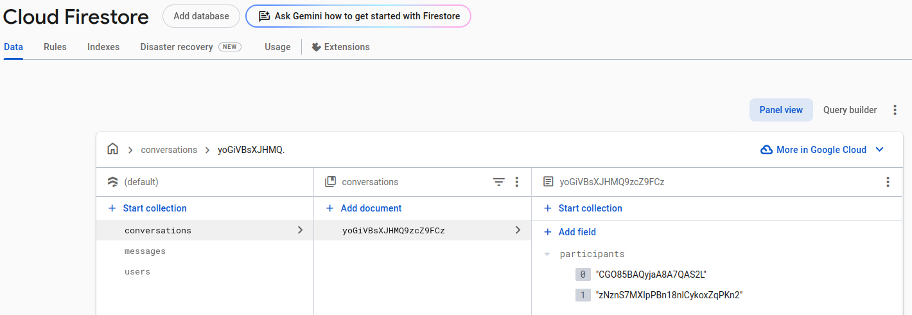
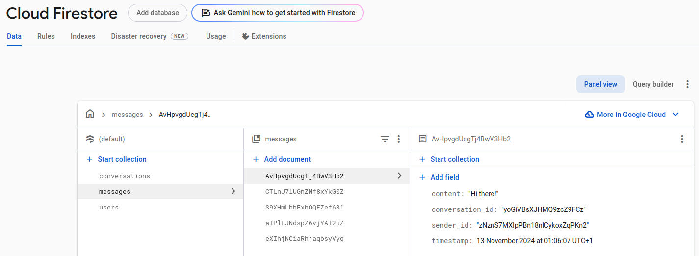
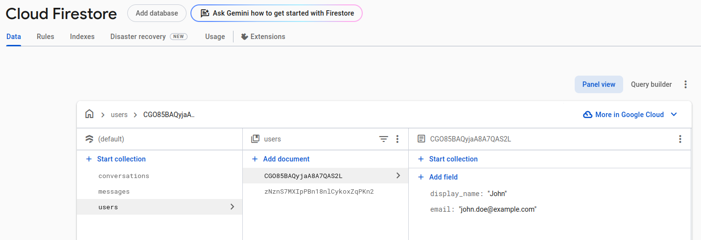

I set up a composite index as it was needed for sorting of my messages by descending timestamp (since we want to first show the most recent messages at the bottom of your screen, like on other chat apps).
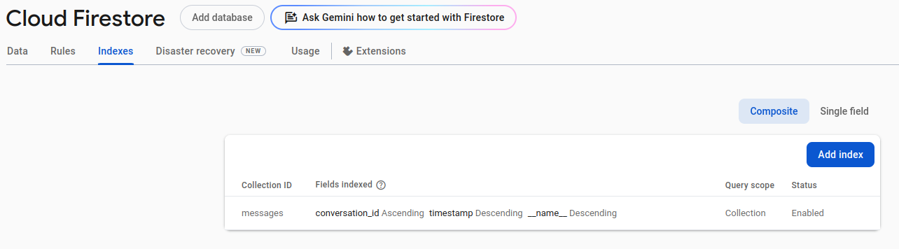

As a bonus I also set up signing with email and password!
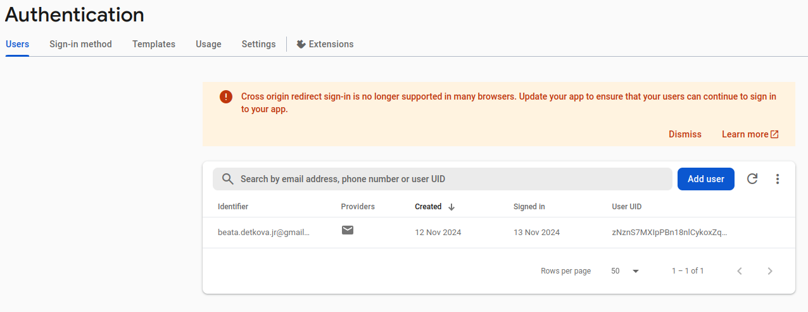

### MediCare App

So what you can do in this app? I will lead you through the product in the following pictures! 😉

1. When you start the app, you arrive on the `Login` screen. Here you can either login with your already created user (available users [here](#users)), or you can press `Register` and you will be redirected into new screen where you can register.

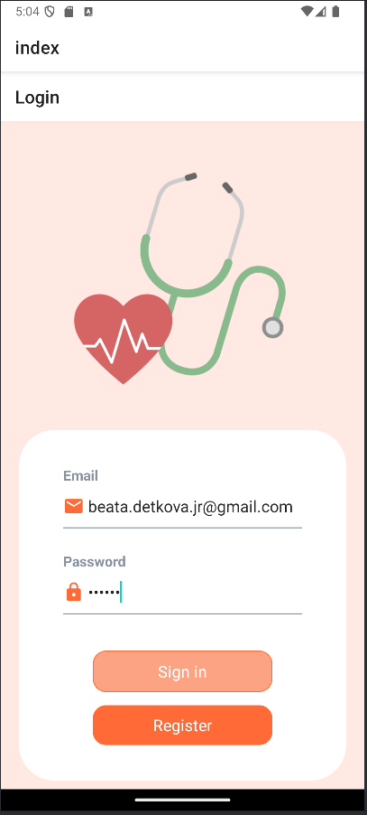

2. If you clicked on `Register`, you arrive on this step. In this screen, you can create your account by providing **name, email and password**. After filling all fields, you can press `Register` which will move you back to the `Login` screen or if you don't wish to register, click on the back button on top left section to go back to the `Login` screen.

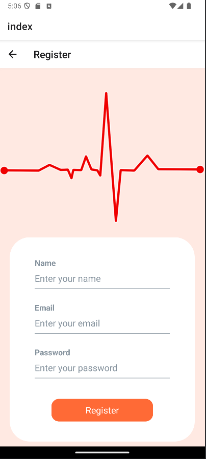

3. After sucessfully registering or logging in, you arrive on the `Conversation` screen where you have two options:

- click on one of the existing conversations
- click on the "+" button to open a modal where you can select a user with whom to start a new conversation

**Conversation list**

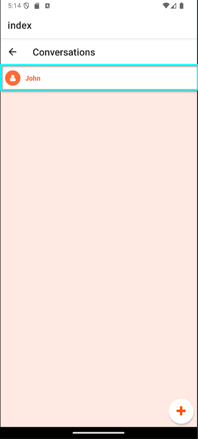

**How to create a new conversation?**

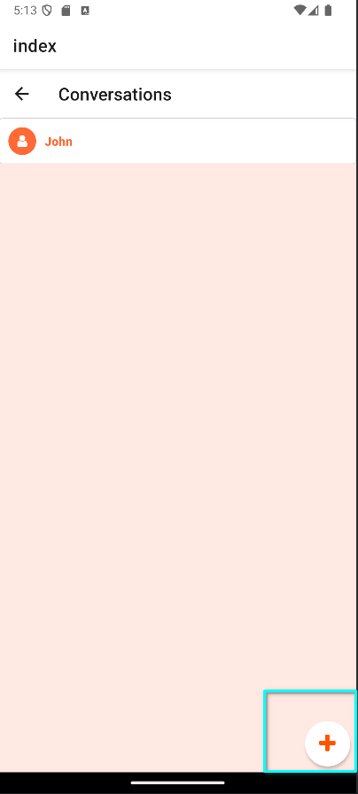

**User list to create new conversations**

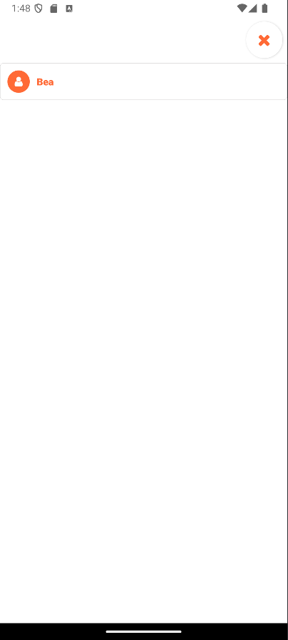

4. If you wish to continue conversating (in this example with John), click on the conversation section which displays "John".

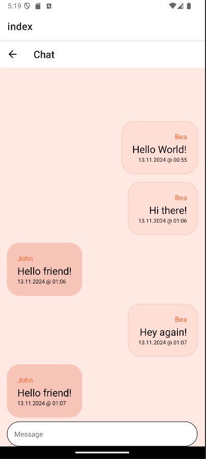

On the **right side** of the chat section are messages which you as a user send to John. On the **left side** are messages which John sends to you.

Each message contains the desired display name (username), its content and a timestamp.

If you wish to type something to the user, you can enter your message in the input field at the bottom of the screen.

### Play around with my app!

#### Users

If you want to log in with any of the preexisting users, feel free to use the credentials below.

**John**

```json
{
  "email": "john.doe@example.com",
  "password": "123456"
}
```

**Jane**

```json
{
  "email": "jane.doe@example.com",
  "password": "123456"
}
```

#### Expected setup

The prepared setup using my [Firebase collections](#environment) will have the following:

- 3 users: John, Jane & myself
- 1 conversation (between John & Jane)
- 1 message inside of this conversation, from Jane

### Potential improvements

1. Add a friend list (so we don't see every single users existing when creating a conversation!)
2. Preview of the last message on the conversation (+ timestamp)
3. Edit/delete messages
4. Delete conversations
5. Ability to log off (right now the login is persisted on mobile)
6. User activity (last time online, message seen, etc.)
7. Avatar support on register (being able to add custom avatars)
8. Settings menu to be able to edit user profile
9. Support for group chats
10. Support for media (sending pictures)
11. Support for audio (call/sending recordings)
12. Support for attachments (files)
13. Search (conversation, message)
14. (Mobile only) Refresh on pull -> right now we rely on the fact that we are listening for change on the collection for the data to be up to date
15. When sending messages -> update state instead of waiting for message to come back (will feel more snappy for user). This will also mean adding a status badge on the message and an indication for when the message failed to be delivered
16. Improved error handling (right now it's a simple alert, we should have field validation in form & proper error screens)
17. Improved design -> in general the design is fairly simple, we might want to make it a bit more crispy, especially for web!
